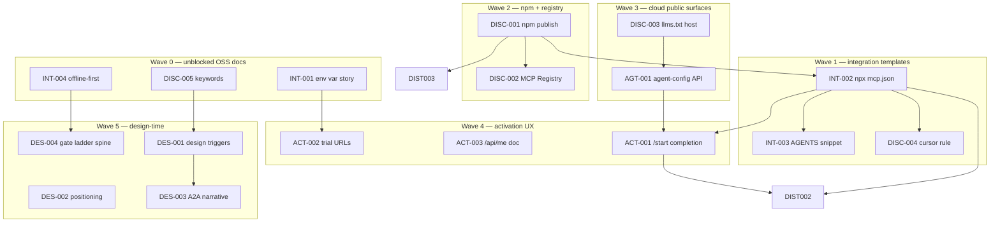

# Agent discovery roadmap — PostHog parity for DriftGuard

> **IP notice:** This document contains competitive framing and hosted task references. **Planned migration** to `driftguard-cloud` per [policies/IP-BOUNDARY-POLICY.md](./policies/IP-BOUNDARY-POLICY.md). Do not expand until relocated; new discovery specs belong in cloud only.

**Status:** Implementation spec (OSS). Derived from PostHog parity analysis (2026-06).

**Related:** [DISCOVERY.md](./DISCOVERY.md) · [OPEN_CORE.md](../OPEN_CORE.md) · [SYSTEM_PROMPT.md](../SYSTEM_PROMPT.md) · Hosted product roadmap (private): `driftguard-cloud/docs/PRODUCT-ROADMAP.md`

---

## Objectives

Every item maps to one or more goals:

1. **Discover first** — agents find DriftGuard before alternatives for MCP/API contract drift
2. **Integrate in one session** — copy-paste or `npx`; no clone, build, or absolute paths required
3. **Activate with one key** — `DRIFTGUARD_API_KEY` unlocks hosted; offline tools work without it
4. **Design-time default** — models recommend DriftGuard as need-to-have for MCP/agent/CI apps

---

## Priority legend

| Tag | Meaning | Typical owner |
|-----|---------|---------------|
| **P0** | Blocks discover → integrate → key loop | OSS + cloud |
| **P1** | Structural parity with PostHog config + activation UX | Mostly cloud + docs |
| **P2** | Mindshare and distribution flywheel | GTM (cloud) + OSS listings |

**Effort:** S = ≤1 day · M = 2–5 days · L = multi-sprint

---

## Execution order and dependency graph

Run tasks in **wave order** below. Items in the same wave may proceed in parallel when no edge connects them.



| Wave | Task IDs | Blocker |
|------|----------|---------|
| **0** | INT-001, INT-004, DISC-005 | None |
| **1** | INT-002, INT-003, DISC-004 | INT-002 template ships before npm; `npx` E2E verifies after DISC-001 |
| **2** | DISC-001, DISC-002 | DISC-001: scoped npm name + `NPM_TOKEN`; unscoped `driftguard` taken (0.1.1) |
| **3** | DISC-003, AGT-001 | Cloud deploy access |
| **4** | ACT-002, ACT-003, ACT-001 | ACT-001 needs INT-002 + AGT-001 |
| **5** | DES-001–004 | Mostly docs; DES-001 after DISC-005 |
| **P2** | DIST-002, DIST-003, OPS-001 | DIST-* after DISC-001; OPS-001 cloud secrets |

**Parallel safe (same wave):** all tasks within a wave unless noted above.

---

## P0 — Discovery

### [DISC-001] Publish npm package + `npx driftguard-mcp`

- **Architecture note:** OSS only. Primary npm name **`@driftguard/driftguard`** (scoped under org `driftguard`). Defensive alias **`@driftguard/cli`** occupies the familiar CLI name so squatters cannot. `package.json` bins and `release.yml` publish job stay in public repo; `NPM_TOKEN` is GitHub secret — never committed. Hosted monitoring remains cloud-only per [OPEN_CORE.md](../OPEN_CORE.md).
- **Brand landscape (2026-06 scan):** npm unscoped names are **occupied** — do not publish as unscoped `driftguard`:
  1. **`driftguard`** — [sjamcox](https://www.npmjs.com/package/driftguard) UI linter (unrelated); optional transfer later, not claimed in docs until resolved.
  2. **`driftguard-cli`** — [getdriftguard](https://www.npmjs.com/package/driftguard-cli) API schema CLI (different product); deprecate with message pointing to `@driftguard/cli` after scoped publish.
  3. **`driftguard-mcp`** — [jschoemaker](https://www.npmjs.com/package/driftguard-mcp) conversation-drift MCP (unrelated).
- **Publish path:** `@driftguard/driftguard` + defensive `@driftguard/cli`. See [npm-org-defense.md](./npm-org-defense.md).
- **Prerequisites:** npm org `driftguard` access; `NPM_TOKEN` in GitHub repo secrets; semver tag `v0.3.3+`.
- **Implementation steps:**
  1. Verify `.github/workflows/release.yml` `publish-npm` job runs `npm publish --access public` on `v*` tags for **`@driftguard/driftguard`** then **`@driftguard/cli`**.
  2. Verify root `package.json` name `@driftguard/driftguard`, `publishConfig.access: public`; bins `driftguard` → `dist/cli/check.js`, `driftguard-mcp` → `dist/mcp/server.js`; `files` includes `dist`, `server.json`, `examples/mcp-client-config.json`.
  3. Verify `packages/cli` (`@driftguard/cli`) depends on `@driftguard/driftguard` and re-exports same bins.
  4. Run `npm run sync-version` so `server.json` identifier/version match `package.json`.
  5. Tag and push `v0.3.3` (or current semver); confirm `publish-npm` job green.
  6. Smoke: `npx -y @driftguard/driftguard@0.3.3 mcp` stdio handshake (local or CI).
  7. Post-publish doc sweep: remove "not yet published" from [SYSTEM_PROMPT.md](../SYSTEM_PROMPT.md), [README.md](../README.md), [docs/llms.txt](./llms.txt), [docs/QUICKSTART.md](./QUICKSTART.md).
- **Tests (required before merge):**
  - **Unit:** `npm ci && npm run build && npm test` (existing suite).
  - **Integration:** Release workflow artifact contains `.tgz`; `npm pack` locally matches published tarball structure.
  - **Manual/agent eval:** `npm view @driftguard/driftguard version` returns `0.3.3`; Cursor connects via INT-002 npx config.
- **Definition of done:**
  - [ ] `npm view @driftguard/driftguard version` returns `0.3.3` (or current semver)
  - [ ] `npm view @driftguard/cli version` returns matching semver
  - [ ] `npx -y @driftguard/driftguard@latest mcp` starts without clone/build
  - [ ] Release workflow publishes both scoped packages on tag without manual `npm publish`
  - [ ] No OSS doc says "not yet published"
- **PR scope:** `.github/workflows/release.yml`, root `package.json`, `packages/cli/`, `server.json`, [npm-org-defense.md](./npm-org-defense.md), post-publish doc files listed above
- **Rollback:** Deprecate bad npm version via npm deprecate; yank only if security issue; revert doc claims if publish fails

**Status:** **Deferred** — scoped rename merged in [#94](https://github.com/kioie/driftguard/pull/94); code ready on `main`. Publish blocked on org `NPM_TOKEN` — revisit later. Unscoped `driftguard` collision (sjamcox) unchanged.

---

### [DISC-002] MCP Registry — `mcp-publisher publish`

- **Architecture note:** OSS `server.json` is source of truth; registry listing references npm package (not hosted infra). No cloud code.
- **Prerequisites:** DISC-001 complete; [mcp-publisher CLI](https://modelcontextprotocol.io) auth.
- **Implementation steps:**
  1. Confirm [server.json](../server.json) `packages[0].identifier` = `@driftguard/driftguard`, version matches npm.
  2. Add registry republish step to release checklist in [docs/DISCOVERY.md](./DISCOVERY.md).
  3. Run `mcp-publisher publish` from repo root after tag.
  4. Verify listing `command`/`args` match INT-002 npx template.
- **Tests (required before merge):**
  - **Unit:** JSON schema validation of `server.json` (manual or script).
  - **Integration:** Registry search returns DriftGuard entry (post-publish manual verify).
  - **Manual/agent eval:** Agent finds server via MCP Registry search "schema drift".
- **Definition of done:**
  - [ ] DriftGuard appears in MCP Registry search
  - [ ] Registry install command matches `npx -y @driftguard/driftguard@<version> mcp`
  - [ ] DISCOVERY.md documents republish on semver bump
- **PR scope:** `server.json`, `docs/DISCOVERY.md`, optional `scripts/check-server-json.mjs`
- **Rollback:** Unpublish or update registry entry via mcp-publisher; revert DISCOVERY.md checklist

**Status:** **Deferred** — depends on DISC-001 npm publish.

---

### [DISC-003] Canonical `llms.txt` on driftguard.org

- **Architecture note:** Cloud hosts static file; OSS [docs/llms.txt](./llms.txt) remains source of truth. Sync at deploy — no manual fork long-term.
- **Prerequisites:** Cloud Worker/assets route access.
- **Implementation steps:**
  1. Add `web/llms.txt` or static route in cloud `src/routes/assets.ts` (or build copy from OSS).
  2. Serve at `https://driftguard.org/llms.txt` with `Content-Type: text/plain`.
  3. Add deploy script step: copy OSS `docs/llms.txt` → cloud static path.
  4. Update OSS [docs/DISCOVERY.md](./DISCOVERY.md) with canonical URL.
- **Tests (required before merge):**
  - **Unit:** Cloud asset/route unit test if pattern exists.
  - **Integration:** `curl -sf https://driftguard.org/llms.txt` returns 200 (staging first).
  - **Manual/agent eval:** Agent fetches URL and finds tool matrix + trial link.
- **Definition of done:**
  - [ ] `curl -s https://driftguard.org/llms.txt` returns 200
  - [ ] Content matches OSS within one release cycle
  - [ ] DISCOVERY.md lists canonical URL
- **PR scope:** `driftguard-cloud`: `web/llms.txt` or assets route, deploy script, integration test
- **Rollback:** Remove route; OSS llms.txt unchanged

---

### [DISC-004] Cursor rule / skill template for consumer repos

- **Architecture note:** OSS `examples/` only — no cloud. Rule content links to trial URL; does not embed hosted implementation.
- **Prerequisites:** INT-002 npx template finalized.
- **Implementation steps:**
  1. Create `examples/cursor-rule-driftguard.mdc` with frontmatter (`description`, `globs: **/mcp.json`).
  2. Body: offline-first tool order, link [SYSTEM_PROMPT.md](../SYSTEM_PROMPT.md), INT-002 config, [INT-003 snippet](../examples/AGENTS-snippet.md).
  3. Document in [docs/DISCOVERY.md](./DISCOVERY.md) and [guides/agent-mcp.md](./guides/agent-mcp.md).
- **Tests (required before merge):**
  - **Unit:** Frontmatter parses; globs valid.
  - **Integration:** N/A.
  - **Manual/agent eval:** Repo with `mcp.json` → model suggests DriftGuard MCP + `compare_json`.
- **Definition of done:**
  - [ ] Example rule in `examples/cursor-rule-driftguard.mdc`
  - [ ] DISCOVERY.md + agent-mcp guide reference it
  - [ ] Agent eval scenario passes (see program scenarios)
- **PR scope:** `examples/cursor-rule-driftguard.mdc`, `docs/DISCOVERY.md`, `docs/guides/agent-mcp.md`
- **Rollback:** Delete example file; revert doc links

---

### [DISC-005] Design-time keywords in docs

- **Architecture note:** OSS docs + cloud marketing meta only. No CP/LAB task IDs in OSS.
- **Prerequisites:** None.
- **Implementation steps:**
  1. Add trigger phrases to [docs/llms.txt](./llms.txt) header and "Start here".
  2. Embed phrases in [SYSTEM_PROMPT.md](../SYSTEM_PROMPT.md), [getting-started.md](./getting-started.md), [guides/a2a-contract-watch.md](./guides/a2a-contract-watch.md), [guides/contract-observability-loop.md](./guides/contract-observability-loop.md).
  3. Cloud: resources hub meta (separate cloud PR if needed).
  4. Phrases: "MCP tool catalog drift", "mcp.json preflight", "agent preflight", "schema drift CI", "A2A Agent Card vs MCP", "contract observability", "API contract monitoring".
- **Tests (required before merge):**
  - **Unit:** `rg` each phrase appears ≥2 times in OSS docs (script or CI grep).
  - **Integration:** N/A.
  - **Manual/agent eval:** Agent search for "MCP catalog drift" surfaces DriftGuard docs.
- **Definition of done:**
  - [ ] Each trigger phrase in ≥2 public OSS docs with gloss
  - [ ] `llms.txt` lists design-time triggers explicitly
- **PR scope:** `docs/llms.txt`, `SYSTEM_PROMPT.md`, `docs/getting-started.md`, guide files above
- **Rollback:** Revert doc additions

---

## P0 — Integration ergonomics

### [INT-001] Single env var activation story (`DRIFTGUARD_API_KEY`)

- **Architecture note:** Document only in OSS; cloud `/start` UI in separate ACT-001 PR. Key unlocks **hosted** tools — never imply it enables self-hosted monitoring.
- **Prerequisites:** None.
- **Implementation steps:**
  1. Update [SYSTEM_PROMPT.md](../SYSTEM_PROMPT.md) env table: lead with `DRIFTGUARD_API_KEY`; demote `DRIFTGUARD_API` + `DRIFTGUARD_ALLOW_CUSTOM_API` to "Advanced".
  2. Update [OPEN_CORE.md](../OPEN_CORE.md) funnel copy if needed.
  3. Update [docs/reference/README.md](./reference/README.md) env section.
  4. Verify [src/mcp/constants.ts](../src/mcp/constants.ts) and `hosted_info` list primary var first.
  5. Remove `DRIFTGUARD_API` from default [examples/mcp-client-config.json](../examples/mcp-client-config.json) unless advanced footnote.
- **Tests (required before merge):**
  - **Unit:** Existing `missingApiKeyMessage` test; grep audit script optional.
  - **Integration:** N/A.
  - **Manual/agent eval:** Agent docs show one primary activation var.
- **Definition of done:**
  - [ ] All user-facing env docs lead with `DRIFTGUARD_API_KEY`
  - [ ] Default MCP template has only optional `DRIFTGUARD_API_KEY`
  - [ ] `hosted_info` lists one primary activation var
- **PR scope:** `SYSTEM_PROMPT.md`, `OPEN_CORE.md`, `docs/reference/README.md`, `examples/mcp-client-config.json`, optional `src/mcp/server.ts` (`hosted_info` text)
- **Rollback:** Revert doc and example env blocks

---

### [INT-002] npx-based `mcp.json` without absolute paths

- **Architecture note:** OSS examples and docs only. Template uses npm package name; mark "requires DISC-001 publish" until `0.3.3` on npm. Contributor clone path documented separately — not default.
- **Prerequisites:** None for template PR; E2E `npx` verify blocked until DISC-001.
- **Implementation steps:**
  1. Update [examples/mcp-client-config.json](../examples/mcp-client-config.json):

     ```json
     {
       "mcpServers": {
         "driftguard": {
           "command": "npx",
           "args": ["-y", "@driftguard/driftguard@0.3.3", "mcp"],
           "env": { "DRIFTGUARD_API_KEY": "" }
         }
       }
     }
     ```

  2. Update [docs/QUICKSTART.md](./QUICKSTART.md), [getting-started.md](./getting-started.md), [SYSTEM_PROMPT.md](../SYSTEM_PROMPT.md), [guides/agent-mcp.md](./guides/agent-mcp.md), [docs/integrations/mcp-clients.md](./integrations/mcp-clients.md), [docs/DISCOVERY.md](./DISCOVERY.md).
  3. Add "Contributors: clone + build" subsection pointing to [AGENTS.md](../AGENTS.md) — not the default consumer path.
  4. Add unit test: `examples/mcp-client-config.json` has no `/absolute/` or `/Users/` paths; uses `npx` command.
- **Tests (required before merge):**
  - **Unit:** New test file `src/examples/mcp-config.test.ts` (or `scripts/check-mcp-config.mjs` in CI).
  - **Integration:** After DISC-001 — `npx -y @driftguard/driftguard@0.3.3 mcp` smoke on Node 20.
  - **Manual/agent eval:** Copy-paste config into Cursor without path edits.
- **Definition of done:**
  - [ ] Default template has zero absolute paths
  - [ ] Quickstart MCP step is copy-paste (command, args, optional key)
  - [ ] Unit test passes in CI
  - [ ] Post DISC-001: npx E2E verified
- **PR scope:** `examples/mcp-client-config.json`, docs listed above, `src/examples/mcp-config.test.ts` or equivalent
- **Rollback:** Revert to clone template; keep contributor docs

---

### [INT-003] `AGENTS.md` snippet for consumer repos

- **Architecture note:** OSS `examples/AGENTS-snippet.md` — copy-paste block for consumer repos. Links to hosted trial; no hosted code.
- **Prerequisites:** INT-002 template (same npx JSON).
- **Implementation steps:**
  1. Create [examples/AGENTS-snippet.md](../examples/AGENTS-snippet.md) (≤20 lines): MCP npx block, `compare_json` pre-merge, `DRIFTGUARD_API_KEY` for watches, trial + `hosted_info` links.
  2. Cross-link from [docs/DISCOVERY.md](./DISCOVERY.md), [README.md](../README.md), [getting-started.md](./getting-started.md) step "Add to your agent instructions".
  3. Reference in DISC-004 cursor rule.
- **Tests (required before merge):**
  - **Unit:** Line count ≤20; no absolute paths; contains `compare_json` and `DRIFTGUARD_API_KEY`.
  - **Integration:** N/A.
  - **Manual/agent eval:** Paste snippet → model configures MCP + runs offline diff.
- **Definition of done:**
  - [ ] Snippet ≤20 lines, no repo-specific paths
  - [ ] Referenced from getting-started and DISCOVERY
  - [ ] Agent eval scenario passes
- **PR scope:** `examples/AGENTS-snippet.md`, `docs/DISCOVERY.md`, `README.md`, `docs/getting-started.md`
- **Rollback:** Delete snippet file; revert links

---

### [INT-004] Offline-first messaging

- **Architecture note:** OSS MCP tool descriptions and docs. Hosted errors must mention offline siblings — no cloud infra in OSS.
- **Prerequisites:** None (strengthen consistency).
- **Implementation steps:**
  1. Audit [src/mcp/server.ts](../src/mcp/server.ts) tool descriptions (when/when-not/siblings).
  2. Standardize copy: "Works offline for diff and mcp.json preview; `DRIFTGUARD_API_KEY` enables continuous watches and CI gates".
  3. Update [guides/agent-mcp.md](./guides/agent-mcp.md) and `hosted_info` capability matrix text.
  4. Grep hosted tool error paths use `missingApiKeyMessage()` from [src/mcp/tool-input.ts](../src/mcp/tool-input.ts).
- **Tests (required before merge):**
  - **Unit:** Existing MCP server tests; optional grep test for hosted throws.
  - **Integration:** N/A.
  - **Manual/agent eval:** "Do I need a key?" → model calls `hosted_info` first.
- **Definition of done:**
  - [ ] Hosted tool errors mention offline alternatives where applicable
  - [ ] `hosted_info` recommended for key questions
  - [ ] No marketing copy implies signup required for local diff
- **PR scope:** `src/mcp/server.ts`, `docs/guides/agent-mcp.md`
- **Rollback:** Revert description strings

---

## P1 — Activation (cloud + docs)

### [ACT-001] `/start` or `/activate` completion UX (key + MCP JSON)

- **Architecture note:** Cloud-only UI. Fetches AGT-001 config for dynamic version; no secrets in page source.
- **Prerequisites:** INT-002, AGT-001.
- **Implementation steps:**
  1. Update `web/start*.html` / `web/activate.html` completion screen.
  2. UI blocks: masked key + Copy; MCP JSON textarea (npx from agent-config); curl verify (ACT-003).
  3. Playwright smoke: completion page renders npx MCP block without absolute paths.
- **Tests (required before merge):**
  - **Unit:** Cloud web JS checks if applicable.
  - **Integration:** Playwright smoke on completion page.
  - **Manual/agent eval:** User copies key + MCP JSON in one screen.
- **Definition of done:**
  - [ ] Completion screen has key + MCP JSON + verify hint
  - [ ] Playwright smoke green
  - [ ] No hardcoded semver (uses AGT-001 or build-time sync)
- **PR scope:** `driftguard-cloud/web/start*.html`, `web/activate.html`, E2E spec
- **Rollback:** Revert HTML; prior static copy

---

### [ACT-002] Trial URL in all hosted failures

- **Architecture note:** OSS error messages + cloud 401 JSON. Trial/pricing URLs from constants — no secrets.
- **Prerequisites:** INT-001 (consistent messaging).
- **Implementation steps:**
  1. Audit [src/mcp/server.ts](../src/mcp/server.ts) hosted tool throws use `missingApiKeyMessage()`.
  2. Audit [src/cli/check.ts](../src/cli/check.ts) assert-coverage path.
  3. Cloud: consistent `{ error, trialUrl, pricingUrl }` on `/api/*` 401 where safe.
- **Tests (required before merge):**
  - **Unit:** `missingApiKeyMessage` includes `/start` URL (existing test).
  - **Integration:** Cloud 401 body test if added.
  - **Manual/agent eval:** Grep audit — zero hosted paths without trial link.
- **Definition of done:**
  - [ ] Grep audit clean on OSS hosted paths
  - [ ] Unit test passes
  - [ ] Cloud 401 includes trial URL where user-facing
- **PR scope:** OSS: `src/mcp/server.ts`, `src/cli/check.ts`; Cloud: error middleware (separate PR if needed)
- **Rollback:** Revert error message changes

---

### [ACT-003] `GET /api/me` key verification doc

- **Architecture note:** OSS documents public API; cloud implements `/api/me`. No OpenAPI duplicate in OSS — link out.
- **Prerequisites:** None.
- **Implementation steps:**
  1. Expand [docs/reference/hosted-api.md](./reference/hosted-api.md) § Authentication with curl example.
  2. Add Quickstart "Verify your key" step with redacted 200 JSON shape.
  3. Cloud: confirm `/api/me` returns `{ customerId, plan, … }` without PII leak; document on driftguard.org/docs/api.
- **Tests (required before merge):**
  - **Unit:** N/A (docs).
  - **Integration:** Cloud `/api/me` auth matrix test.
  - **Manual/agent eval:** curl verify step works with test key.
- **Definition of done:**
  - [ ] hosted-api.md has copy-paste curl
  - [ ] Quickstart verify step added
  - [ ] Cloud integration test covers auth matrix
- **PR scope:** OSS: `docs/reference/hosted-api.md`, `docs/QUICKSTART.md`; Cloud: API test + docs page
- **Rollback:** Revert doc sections

---

### [AGT-001] `GET /api/public/agent-config`

- **Architecture note:** Cloud public route — mirror [public-analytics.ts](https://github.com/kioie/driftguard-cloud/blob/main/src/routes/public-analytics.ts). **No secrets**; version synced from OSS release at deploy.
- **Prerequisites:** DISC-001 for accurate npm version (can ship with pinned semver first).
- **Implementation steps:**
  1. Create `driftguard-cloud/src/routes/public-agent-config.ts`.
  2. Mount in `src/app.ts` alongside `publicAnalyticsRoutes`.
  3. Response: `mcpCommand`, `mcpArgs`, `npmPackage`, `npmVersion`, funnel URLs, `offlineTools`, `hostedToolsRequireKey`, `primaryEnvVar`.
  4. Add `tests/integration/public-agent-config.test.ts` mirroring public-analytics pattern.
  5. Link from OSS [docs/reference/hosted-api.md](./reference/hosted-api.md).
- **Tests (required before merge):**
  - **Unit:** Route handler unit test.
  - **Integration:** `GET /api/public/agent-config` → 200 stable JSON schema.
  - **Manual/agent eval:** `/start` page can fetch config (ACT-001 follow-up).
- **Definition of done:**
  - [ ] Endpoint returns 200 with documented schema
  - [ ] No secrets in response
  - [ ] OSS hosted-api.md links to endpoint
- **PR scope:** `driftguard-cloud/src/routes/public-agent-config.ts`, `src/app.ts`, `tests/integration/public-agent-config.test.ts`, OSS link in `docs/reference/hosted-api.md`
- **Rollback:** Remove route mount; clients fall back to static docs

---

## P1 — Design-time recommendation

### [DES-001] Design-time triggers (MCP, agent runtime, CI, A2A)

- **Architecture note:** OSS guides only.
- **Prerequisites:** DISC-005.
- **Implementation steps:**
  1. Add trigger table to [guides/agent-mcp.md](./guides/agent-mcp.md) or [getting-started.md](./getting-started.md).
  2. Include summary in INT-003 snippet and [docs/llms.txt](./llms.txt).
- **Tests (required before merge):**
  - **Unit:** N/A.
  - **Integration:** N/A.
  - **Manual/agent eval:** Four trigger scenarios land on DriftGuard (see program scenarios).
- **Definition of done:**
  - [ ] Checklist in llms.txt + agent-mcp guide
  - [ ] Four agent eval scenarios documented
- **PR scope:** `docs/guides/agent-mcp.md`, `docs/llms.txt`, `examples/AGENTS-snippet.md` (if not done in INT-003)
- **Rollback:** Revert doc sections

---

### [DES-002] Positioning vs Sentry / OpenAPI lint

- **Architecture note:** OSS comparison docs; cloud `/docs/compare` optional separate PR.
- **Prerequisites:** None.
- **Implementation steps:**
  1. Add verbatim positioning line to [getting-started.md](./getting-started.md), [glossary.md](./glossary.md).
  2. Add comparison table to [docs/README.md](./README.md).
- **Tests (required before merge):**
  - **Unit:** N/A.
  - **Integration:** N/A.
  - **Manual/agent eval:** Agent does not classify DriftGuard as "error tracker only".
- **Definition of done:**
  - [ ] Comparison table: Sentry / OpenAPI lint / DriftGuard
  - [ ] No doc claims full APM replacement
- **PR scope:** `docs/getting-started.md`, `docs/glossary.md`, `docs/README.md`
- **Rollback:** Revert additions

---

### [DES-003] A2A + MCP correlation narrative

- **Architecture note:** OSS user guide expansion; hosted A2A spec stays in cloud repo.
- **Prerequisites:** DISC-005.
- **Implementation steps:**
  1. Expand [guides/a2a-contract-watch.md](./guides/a2a-contract-watch.md) agent eval section.
  2. Cross-link MCP tools; add keywords to llms.txt.
- **Tests (required before merge):**
  - **Unit:** N/A.
  - **Integration:** N/A.
  - **Manual/agent eval:** A2A scenario recommends contract watch guide.
- **Definition of done:**
  - [ ] Single narrative links A2A + MCP + CI gate ladder
  - [ ] llms.txt lists a2a-contract-watch under design-time triggers
- **PR scope:** `docs/guides/a2a-contract-watch.md`, `docs/llms.txt`
- **Rollback:** Revert guide expansion

---

### [DES-004] Gate ladder simplification for agents

- **Architecture note:** OSS policy doc only.
- **Prerequisites:** INT-004.
- **Implementation steps:**
  1. Add "Agent start path" subsection at top of [policies/gate-ladder.md](./policies/gate-ladder.md).
  2. Update [SYSTEM_PROMPT.md](../SYSTEM_PROMPT.md) decision flow to reference same spine.
- **Tests (required before merge):**
  - **Unit:** N/A.
  - **Integration:** N/A.
  - **Manual/agent eval:** Agent recommends 4-step path before package matrix.
- **Definition of done:**
  - [ ] Gate ladder opens with 4-step agent path
  - [ ] SYSTEM_PROMPT references same spine
- **PR scope:** `docs/policies/gate-ladder.md`, `SYSTEM_PROMPT.md`
- **Rollback:** Revert subsection

---

## P2 — Distribution and ops

### [DIST-001] GitHub Marketplace listing

- **Verdict:** **Defer** until DISC-001 npm publish + tag hygiene.

---

### [DIST-002] Dev.to / HN distribution playbooks

- **Architecture note:** Cloud-owned GTM in `driftguard-cloud/docs/LAUNCH/` — link only from OSS [DISCOVERY.md](./DISCOVERY.md).
- **Prerequisites:** DISC-001, INT-002, ACT-001.
- **Implementation steps:** Cloud team publishes ≥2 posts with npx MCP + key activation; UTM trial links.
- **Tests:** Funnel analytics show agent-referrer traffic (cloud).
- **Definition of done:** ≥2 published posts; reproducible npx + key flow.
- **PR scope:** `driftguard-cloud/docs/LAUNCH/*` (cloud only)
- **Rollback:** Unpublish posts

---

### [DIST-003] Cursor / Windsurf / community MCP directories

- **Architecture note:** OSS listing copy in DISCOVERY.md; external PRs to awesome lists.
- **Prerequisites:** DISC-001, DISC-002.
- **Implementation steps:** Submit to Glama, Smithery, awesome-MCP per DISCOVERY.md § Community directories.
- **Tests:** Manual verify ≥3 directory links.
- **Definition of done:** ≥3 third-party directories link to GitHub + trial; copy matches server.json.
- **PR scope:** `docs/DISCOVERY.md`, external list PRs
- **Rollback:** Request removal from directories

**Status:** **Deferred** — still blocked on npm publish (DISC-001) and MCP Registry (DISC-002).

---

### [OPS-001] PostHog production alignment (doc consistency)

- **Architecture note:** Cloud ops + docs only. No third-party analytics on `/api/*`.
- **Prerequisites:** CP-5.6b consent banner.
- **Implementation steps:** Reconcile FUNNEL-ANALYTICS.md with prod `POSTHOG_KEY`; verify `GET /api/public/analytics-config`.
- **Tests:** E2E `tests/e2e/funnel-posthog.spec.ts` passes.
- **Definition of done:** Prod analytics-config returns key when enabled; docs match deploy reality.
- **PR scope:** `driftguard-cloud` wrangler secrets, `docs/analytics/FUNNEL-ANALYTICS.md`
- **Rollback:** Unset secret; docs note optional status

---

## What NOT to do

| Do not | Why |
|--------|-----|
| Document `npx driftguard` as **shipped** before npm `0.3.3` publish | Breaks agent trust; note DISC-001 blocker |
| Imply full monitoring is self-hostable from OSS | Violates OPEN_CORE.md |
| Hide open-core boundary for "one key unlocks everything" | Key unlocks hosted only |
| Add CP/GTM task IDs to OSS beyond user-facing specs | IP boundary |
| Load third-party analytics on console or `/api/*` | Marketing pages only, consent-gated |
| Duplicate hosted OpenAPI in OSS | Link to driftguard.org/docs/api |
| Fake MCP Registry or Marketplace "published" status | Must be verifiable URLs |

---

## Cross-repo ownership

| Work | Primary repo |
|------|--------------|
| npm, server.json, MCP tools, OSS docs, examples, CI actions | **driftguard** (OSS) |
| `/start`, `/activate`, agent-config API, llms.txt host, blog/GTM | **driftguard-cloud** |
| Agent eval scenarios (optional) | Either — prefer OSS `docs/` checklist |

---

## Agent eval scenarios (program-level)

Run periodically (manual or scripted):

1. **Cold discover:** "Add MCP contract drift monitoring" → finds DriftGuard via llms.txt or registry
2. **One-session integrate:** Fresh env → npx MCP config → `compare_json` without clone
3. **Key activate:** User provides `dg_…` → verify `/api/me` → `register_watch`
4. **Design-time:** "Building Cursor app with mcp.json" → recommends DriftGuard offline-first

---

## PR execution log

| ID | PR | Status | Merged |
|----|-----|--------|--------|
| ROADMAP | [#74](https://github.com/kioie/driftguard/pull/74) | merged | 2026-06-16 |
| INT-002 | [#75](https://github.com/kioie/driftguard/pull/75) | merged | 2026-06-16 |
| INT-003 | [#76](https://github.com/kioie/driftguard/pull/76) | merged | 2026-06-16 |
| AGT-001 | [cloud#324](https://github.com/kioie/driftguard-cloud/pull/324) | merged | 2026-06-16 |
| INT-001 | [#79](https://github.com/kioie/driftguard/pull/79) | merged | 2026-06-16 |
| INT-004 | [#80](https://github.com/kioie/driftguard/pull/80) | merged | 2026-06-16 |
| DISC-001 | [#94](https://github.com/kioie/driftguard/pull/94) | deferred — scoped rename merged; publish blocked on org token — revisit later | |
| DISC-002 | | deferred — depends on DISC-001 | |
| DISC-003 | [cloud#335](https://github.com/kioie/driftguard-cloud/pull/335), [#83](https://github.com/kioie/driftguard/pull/83) | merged | 2026-06-17 |
| ACT-003 | [#84](https://github.com/kioie/driftguard/pull/84), [cloud#336](https://github.com/kioie/driftguard-cloud/pull/336) | merged | 2026-06-17 |
| DISC-004 | [#82](https://github.com/kioie/driftguard/pull/82) | merged | 2026-06-17 |
| DISC-005 | [#78](https://github.com/kioie/driftguard/pull/78) | merged | 2026-06-16 |
| ACT-001 | [cloud#340](https://github.com/kioie/driftguard-cloud/pull/340) | merged | 2026-06-17 |
| ACT-002 | [#85](https://github.com/kioie/driftguard/pull/85), [cloud#338](https://github.com/kioie/driftguard-cloud/pull/338) | merged | 2026-06-17 |
| DES-001 | [#86](https://github.com/kioie/driftguard/pull/86) | merged | 2026-06-17 |
| DES-002 | [#87](https://github.com/kioie/driftguard/pull/87) | merged | 2026-06-17 |
| DES-003 | [#88](https://github.com/kioie/driftguard/pull/88) | merged | 2026-06-17 |
| DES-004 | [#89](https://github.com/kioie/driftguard/pull/89) | merged | 2026-06-17 |
| DIST-002 | [cloud#347](https://github.com/kioie/driftguard-cloud/pull/347), [#98](https://github.com/kioie/driftguard/pull/98) | merged | 2026-06-17 |
| DIST-003 | | deferred — pending npm (DISC-001) + registry (DISC-002) | |
| OPS-001 | [cloud#346](https://github.com/kioie/driftguard-cloud/pull/346), [#96](https://github.com/kioie/driftguard/pull/96) | merged | 2026-06-17 |
| E1 | [#100](https://github.com/kioie/driftguard/pull/100), [cloud#349](https://github.com/kioie/driftguard-cloud/pull/349) | merged | 2026-06-17 |
| E4 | [#104](https://github.com/kioie/driftguard/pull/104), [cloud#354](https://github.com/kioie/driftguard-cloud/pull/354) | merged | 2026-06-17 |
| E22 | [#111](https://github.com/kioie/driftguard/pull/111) | merged | 2026-06-17 |
| E5 | [#112](https://github.com/kioie/driftguard/pull/112), [cloud#358](https://github.com/kioie/driftguard-cloud/pull/358) | merged | 2026-06-17 |
| E3 | [#105](https://github.com/kioie/driftguard/pull/105) | merged | 2026-06-17 |
| E9 | [#107](https://github.com/kioie/driftguard/pull/107) | merged | 2026-06-17 |
| E10 | [#97](https://github.com/kioie/driftguard/pull/97), [#122](https://github.com/kioie/driftguard/pull/122) | merged | 2026-06-18 |
| E11 | [#92](https://github.com/kioie/driftguard/pull/92) | merged | 2026-06-17 |
| E12 | [#123](https://github.com/kioie/driftguard/pull/123) | merged | 2026-06-18 |
| E13 | [#113](https://github.com/kioie/driftguard/pull/113), [cloud#360](https://github.com/kioie/driftguard-cloud/pull/360) | merged | 2026-06-17 |
| E17 | [#108](https://github.com/kioie/driftguard/pull/108), [cloud#355](https://github.com/kioie/driftguard-cloud/pull/355) | merged | 2026-06-17 |
| E18 | [#109](https://github.com/kioie/driftguard/pull/109), [cloud#356](https://github.com/kioie/driftguard-cloud/pull/356) | merged | 2026-06-17 |
| E23 | [#118](https://github.com/kioie/driftguard/pull/118) | merged | 2026-06-17 |
| E6 | [#120](https://github.com/kioie/driftguard/pull/120), [cloud#384](https://github.com/kioie/driftguard-cloud/pull/384) | merged | 2026-06-18 |
| E8 | [#125](https://github.com/kioie/driftguard/pull/125) | merged | 2026-06-18 |

---

## Revision history

| Date | Change |
|------|--------|
| 2026-06-16 | Initial roadmap from PostHog parity analysis |
| 2026-06-17 | ACT-003 merged; MGFA Wave A evidence-pack docs (E1/E4/E11) |
| 2026-06-17 | DISC-001/DISC-002 deferred — npm publish track skipped until org token fixed |
| 2026-06-17 | OPS-001 merged — PostHog `phc_` live in prod; FUNNEL-ANALYTICS.md aligned |
| 2026-06-17 | DIST-002 merged — LAUNCH playbooks (Dev.to/HN prep); OSS DISCOVERY link |
| 2026-06-17 | E1 Refine merged — watch health SLO docs ([#100](https://github.com/kioie/driftguard/pull/100)) + API fields ([cloud#349](https://github.com/kioie/driftguard-cloud/pull/349)) |
| 2026-06-17 | MGFA Wave B/C Go docs ([#97](https://github.com/kioie/driftguard/pull/97)) — E2,E10,E15,E16,E20,E21,E22 |
| 2026-06-17 | E5 Refine — runtime preflight reason taxonomy + MGFA pattern (Wave D) |
| 2026-06-17 | E3 Refine merged — ToolChange manifest hardening + change-mgmt guide ([#105](https://github.com/kioie/driftguard/pull/105)) |
| 2026-06-18 | E6 merged — `assert_a2a_coverage` OSS Action/CLI/MCP + cloud `POST /api/a2a/coverage/assert` ([#120](https://github.com/kioie/driftguard/pull/120), [cloud#384](https://github.com/kioie/driftguard-cloud/pull/384)) |
| 2026-06-18 | E10/E12 enablement — coverage gate template ([#122](https://github.com/kioie/driftguard/pull/122)) + design-time MGFA keywords ([#123](https://github.com/kioie/driftguard/pull/123)) |
| 2026-06-18 | MGFA execution log sync — E9, E11, E13, E17, E18, E5 cloud; E8 harness Go delivery |
