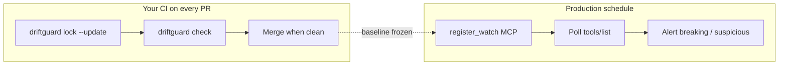

# CI distribution model

DriftGuard CI is designed as a **hook → trial → paid** funnel. Embed a version pin in your pipeline, get value immediately, then upgrade when you need full coverage gates.

**Pin policy:** `uses: Drift-Guard/driftguard/...@v0.3.3` or `npx @driftguard/driftguard@0.3.3` — never `@main`.

**Simplest add:** copy [examples/workflows/driftguard-starter.yml](../examples/workflows/driftguard-starter.yml) to `.github/workflows/driftguard.yml` — no manual JSON scan step.

**GitLab:** [docs/GITLAB_CI.md](./GITLAB_CI.md) · **Marketplace:** [docs/GITHUB_MARKETPLACE.md](./GITHUB_MARKETPLACE.md)

---

## The funnel

```
┌─────────────────────────────────────────────────────────────────┐
│ 1. HOOK (free, unlimited)                                       │
│    drift-diff / compare_json                                    │
│    → Teams see breaking schema changes in CI                     │
├─────────────────────────────────────────────────────────────────┤
│ 2. PREVIEW (free, non-blocking by default)                      │
│    drift-coverage-preview / coverage-preview                    │
│    → Discovers N endpoints, 0–1 covered on trial                │
│    → Prints console + trial links in GitHub Step Summary          │
├─────────────────────────────────────────────────────────────────┤
│ 3. TRIAL (1 endpoint, full Pro in console)                      │
│    /start?from=ci&import=…                                      │
│    → CI deep link pre-fills first missing watch                 │
├─────────────────────────────────────────────────────────────────┤
│ 4. GATE (paid or trial-limited)                                 │
│    drift-coverage + DRIFTGUARD_API_KEY                          │
│    → Fails CI until all discovered deps are watched             │
│    → Trial: only 1 endpoint — multi-deps forces Pro upgrade     │
└─────────────────────────────────────────────────────────────────┘
```

| Tier | Action / command | API key | Blocks CI? | Endpoint limit |
|------|------------------|---------|------------|----------------|
| **Hook** | `drift-diff` | No | On breaking diff only | Unlimited diff |
| **MCP lockfile** | `mcp-lockfile` / `driftguard lock` + `check` | No | On configured severity (default breaking) | Per MCP server in lockfile |
| **Preview** | `drift-coverage-preview` | No | Optional (`fail-on-missing`) | Shows all; covers 0 |
| **Trial gate** | `drift-coverage` + trial session | Trial header | Yes | **1 endpoint** |
| **Pro gate** | `drift-coverage` + API key | `dg_…` | Yes | Plan limit (50 Pro) |

---

## Layer 1 — Hook (free)

```yaml
- uses: Drift-Guard/driftguard/.github/actions/drift-diff@v0.3.3
  with:
    before: '{"status":"ok","data":{"id":1,"name":"test"}}'
    after: '{"status":"ok","data":{"id":1}}'
```

```bash
npx @driftguard/driftguard@0.3.3 diff "$BEFORE" "$AFTER"
```

---

## MCP lockfile + hosted watch (dual path)

Use **lockfile check in CI** (your deploy) and **hosted watches** (vendor drift between deploys). See [agent-mcp.md](./guides/agent-mcp.md) and [mcp-lockfile-bridge.md](./guides/mcp-lockfile-bridge.md).



**Snapshot baseline (no API key):**

```yaml
- uses: actions/checkout@v4
- uses: Drift-Guard/driftguard/.github/actions/mcp-lockfile@v0.3.3
  with:
    lockfile: driftguard-lock.json
    fail-on: breaking
```

**Refresh lockfile after reviewed drift:**

```bash
driftguard lock --config mcp.json -o driftguard-lock.json
# or: driftguard lock --url https://mcp.example.com/mcp
driftguard lock --update
```

**Governance-heavy repos** — fail on semantic drift:

```bash
driftguard check --lock driftguard-lock.json --fail-on suspicious
```

### Builder conformance (partner CI)

If you **ship** an MCP server, add invocation tests with your conformance harness **in addition to** catalog lockfile gates. DriftGuard does not replace `tools/call` probes — see [mcp-conformance-partners.md](./guides/mcp-conformance-partners.md).

Copy [examples/workflows/mcp-conformance-stub.yml](../examples/workflows/mcp-conformance-stub.yml) for a GitHub Actions layout: commented partner harness job + active `mcp-lockfile` check.

---

## Layer 2 — Preview (free, hooks upgrade)

Scans `mcp.json`, OpenAPI specs, and URLs in repo files via **`scan-paths`** (no custom Node step). **Does not block** your pipeline by default — it writes a Step Summary with unmonitored endpoints and one-click console links.

```yaml
- uses: actions/checkout@v4
- uses: Drift-Guard/driftguard/.github/actions/drift-coverage-preview@v0.3.3
  with:
    scan-paths: mcp.json,.cursor/mcp.json,package.json
    # fail-on-missing: true   # optional — turn on after upgrading
```

<details>
<summary>Advanced: explicit files-json</summary>

```yaml
- uses: Drift-Guard/driftguard/.github/actions/drift-coverage-preview@v0.3.3
  with:
    files-json: ${{ steps.scan.outputs.files-json }}
```

</details>

Console link (from Step Summary): `/console?from=ci&import=…` — bulk import panel + upgrade nudges.

**One-click CI trial:** Step Summary includes `DRIFTGUARD_TRIAL_SESSION` (auto-minted) and a link to `/ci/setup?from=ci&import=…` to copy the GitHub secret and workflow snippet.

---

## Layer 3 — Trial (console, 1 endpoint)

After preview, open **CI trial setup** in the Step Summary or visit:

`https://driftguard.org/ci/setup?from=ci&import=…`

That page mints a trial session, shows the secret to paste into GitHub, and links to the console to import discovered endpoints. The start wizard (`/start?from=ci`) still pre-fills the first missing watch.

For CI gate with trial (1 endpoint only):

```yaml
- uses: actions/checkout@v4
- uses: Drift-Guard/driftguard/.github/actions/drift-coverage@v0.3.3
  with:
    trial-session: ${{ secrets.DRIFTGUARD_TRIAL_SESSION }}
    scan-paths: mcp.json,.cursor/mcp.json,package.json
```

Mint a session manually:

```bash
curl -sX POST https://driftguard.org/api/trial/session \
  -H 'content-type: application/json' \
  -d '{"repo":"org/repo"}' | jq -r '.trialGate.envVar'
```

If CI finds **multiple** endpoints, the gate fails with an upgrade message — that is intentional.

---

## Layer 4 — Pro gate (paid)

Add `DRIFTGUARD_API_KEY` (from [pricing](https://driftguard.org/pricing) → activate):

```yaml
- uses: actions/checkout@v4
- uses: Drift-Guard/driftguard/.github/actions/drift-coverage@v0.3.3
  with:
    api-key: ${{ secrets.DRIFTGUARD_API_KEY }}
    scan-paths: mcp.json,.cursor/mcp.json,package.json
```

Failures include `upgrade.console` URL to import missing watches without leaving your browser.

---

## Version embedding

| Mechanism | Example |
|-----------|---------|
| GitHub Action ref | `@v0.3.3` |
| npx | `npx @driftguard/driftguard@0.3.3` |
| CLI | `driftguard version --json` → `ci.actionRef`, `ci.npx` |
| Client header | `X-DriftGuard-Client-Version` on hosted calls |

Setup action installs from **npm** or **GitHub Release** `.tgz` fallback.

---

## Recommended starter workflow

See [examples/workflows/driftguard-starter.yml](../examples/workflows/driftguard-starter.yml) (recommended), [drift-diff.yml](../examples/workflows/drift-diff.yml), and [drift-coverage.yml](../examples/workflows/drift-coverage.yml).

Typical progression:

1. Add `drift-diff` on PRs (immediate value).
2. Add `drift-coverage-preview` (shows gap, links to console).
3. For MCP dependencies: `driftguard lock` + `mcp-lockfile` action on PRs; `register_watch` in production.
4. Start trial from CI link → first watch in console.
5. Add `DRIFTGUARD_API_KEY` → switch preview to `drift-coverage` gate.

---

## API reference (hosted)

| Route | Auth | Funnel tier |
|-------|------|-------------|
| `POST /api/coverage/preview` | None (rate-limited) | Preview |
| `POST /api/coverage/assert` | API key or trial session | Gate |
| `GET /health` | None | Deploy smoke |

Headers: `X-DriftGuard-CI-Repo`, `X-DriftGuard-Client-Version` (optional).

---

## Upgrade URLs

All preview/assert responses include:

- `upgrade.start` — trial wizard with CI import
- `upgrade.console` — import missing watches
- `upgrade.pricing` — Pro/Team plans
- `upgrade.activate` — API key after checkout

Hosted monitoring (alerts, MCP polling, history) requires Pro/Team — see [OPEN_CORE.md](../OPEN_CORE.md).
