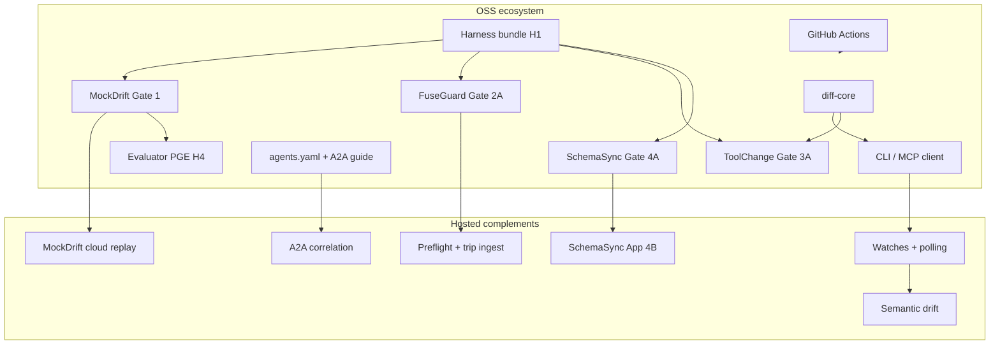
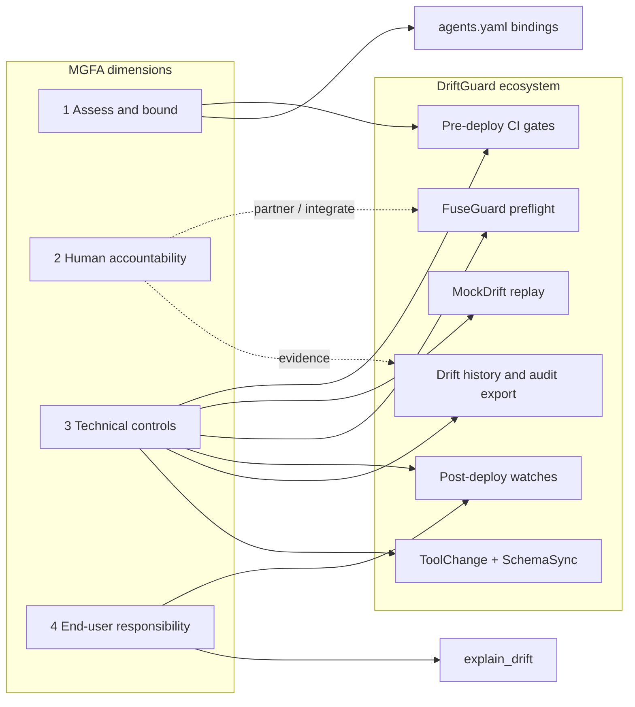

# Singapore MGFA — product fit guiding document

**Status:** Strategic orientation (OSS). Not a compliance certification, attestation, or legal advice.

**Related:** [ROADMAP.md](./ROADMAP.md) · [policies/gate-ladder.md](./policies/gate-ladder.md) · [OPEN_CORE.md](../OPEN_CORE.md) · Hosted product roadmap (private): `driftguard-cloud/docs/PRODUCT-ROADMAP.md`

---

## Purpose and scope

Singapore's **Model AI Governance Framework for Agentic AI (MGFA)** — IMDA v1.5 (Jan 2026 launch; iterative updates through public feedback) — describes how organisations should assess, bound, and govern agentic AI across the lifecycle. The **DriftGuard ecosystem** does **not** replace an MGFA programme. We sit in one lane: **contract observability** — detecting when MCP tools, API schemas, Agent Cards, prompts, and declared agent bindings drift from what downstream systems expect.

This document covers **all ecosystem products** — not only the core CLI/MCP client and hosted watches. That includes gate packages (MockDrift, FuseGuard, ToolChange, SchemaSync), the shared diff library (`@driftguard/diff-core`), the portable harness bundle, the evaluator/PGE loop, A2A Contract Watch, and hosted complements (cloud replay, preflight, trip ingest, semantic drift, GitHub Apps).

This document is a **guiding light** for product and engineering:

| In scope | Out of scope |
|----------|----------------|
| Map MGFA dimensions to **each product's** existing and planned capabilities | Claim MGFA compliance or certification |
| Catalog enhancements with **direct fit** to MGFA controls, tagged by owning product(s) | Produce per-feature roadmaps (those come later) |
| Prioritise deep-dives by impact × effort × MGFA directness | Duplicate hosted control-plane specs (`CP-*`, pricing, GTM) in the public repo |
| Provide a reusable assessment template for future reviews | Build identity, HITL, policy eval, or full APM stacks in-house |

Each catalog entry below will eventually receive its **own roadmap** after assessment review. **Value/soundness assessments (Draft)** for E1–E23 live in [docs/assessments/mgfa/](./assessments/mgfa/) — see [Enhancement assessments](#enhancement-assessments).

**Audience:** product, engineering, and GTM teams evaluating Singapore and APAC agentic-AI deployments where contract drift is a material risk.

---

## Product portfolio overview

The DriftGuard ecosystem is an **open-core platform**: OSS gate packages and client tools funnel to hosted monitoring, preflight, and enterprise complements. See [OPEN_CORE.md](../OPEN_CORE.md) and [docs/ROADMAP.md](./ROADMAP.md).

| Product | What it does | Primary MGFA dimension | OSS / Hosted |
|---------|--------------|------------------------|--------------|
| **DriftGuard Core (CLI + MCP)** | Local JSON schema diff; offline `mcp.json` preview; hosted API proxy when keyed | Dim 3 — dev controls, pre-deploy testing | OSS client · hosted tools via API key |
| **`@driftguard/diff-core`** | Canonical schema inference and diff semantics shared by CLI, cloud, ToolChange | Dim 3 — reproducible structural checks | OSS library |
| **MockDrift (Gate 1)** | Drift-replay harness for agent/mock tests; ToolProxy, scenarios, cloud `--simulate-drift` | Dim 3 — pre-deployment safety testing | OSS · cloud replay + fixture catalog (H5) hosted |
| **FuseGuard (Gate 2A)** | Loop/budget fuse; optional hosted contract preflight before tool calls; trip logs | Dim 3 — guardrails; Dim 2 — trip evidence (partner workflows) | OSS runtime · hosted preflight + trip ingest (2B) |
| **agents.yaml lint (Gate 2B)** | Declared agent bindings, skill↔tool map, watch refs — CI lint | Dim 1 — bound tool scope; Dim 3 — structural dev controls | OSS lint · hosted watch resolution roadmap |
| **A2A Contract Watch** | Agent Card ↔ MCP correlation; orchestrator status and block webhooks | Dim 3 — multi-protocol change management | OSS guide + rules · hosted correlation (DES-003) |
| **Harness bundle (H1)** | Portable `.driftguard/` — `gates.yaml`, `harness.lock`, bundle lint | Dim 3 — reproducible pre-deploy test baselines | OSS |
| **Evaluator / PGE (H4, Gate 1b)** | Producer ≠ reviewer CI; rule-only evaluator reads `mockdrift.sensor/v1` only | Dim 3 — pre-deploy agent workflow testing | OSS rule evaluator · hosted LLM evaluator (Enterprise) |
| **ToolChange (Gate 3A)** | Manifest-first PR lint for MCP tool schema changes vs baseline | Dim 3 — change management for tool surfaces | OSS (alpha) |
| **SchemaSync (Gate 4A)** | Literal (and advisory semantic) prompt↔schema alignment lint | Dim 3 — instruction/tool consistency | OSS `lint-nl` · hosted GitHub App (4B) |
| **Hosted DriftGuard** | Scheduled watches, MCP `tools/list` polling, drift history, alerts, console, semantic drift, audit export | Dim 3 — post-deploy monitoring; Dim 4 — transparency | Hosted only |
| **CI / GitHub Actions** | `drift-diff`, coverage preview/gate, gate package actions, harness lint | Dim 3 — CI enforcement across lifecycle | OSS actions · hosted gates need API key |
| **`explain_drift` (public endpoint)** | Remediation hints after breaking structural changes | Dim 4 — operator transparency | Public endpoint (no key) |



---

## Ecosystem lane in MGFA terms

MGFA organises guidance in four dimensions. The ecosystem contributes evidence and controls primarily under **Dimension 3 — Implement technical controls and processes**, with secondary support for **Dimension 1 — Assess and bound risks** (scope of tool/protocol impact via bindings and coverage) and **Dimension 4 — Enable end-user responsibility** (transparency of contract changes). **Dimension 2 — Make humans meaningfully accountable** is mostly partner territory (HITL, approval workflows, override analytics) — though FuseGuard trip logs and webhook ack trails supply **evidence** for human oversight.



### Dimension map (ecosystem-wide)

| MGFA dimension | MGFA emphasis (v1.5) | Ecosystem fit | Primary surfaces |
|----------------|----------------------|---------------|------------------|
| **1 — Assess and bound risks** | Tool access limits, protocol attack surfaces, reversibility of actions | **Partial** — surfaces *what* changed in tools/protocols/bindings; does not set IAM or sandbox boundaries | `parse_mcp_config`, ToolChange, agents.yaml lint, `assert_coverage`, A2A skillToolMap |
| **2 — Make humans meaningfully accountable** | HITL checkpoints, override audits, value-chain responsibility | **Gap (partner)** — drift/trip signals feed humans; we do not run approval queues | Webhooks → customer SOAR/ITSM; FuseGuard trip logs; ack-gated deploy blocks |
| **3 — Implement technical controls and processes** | Dev controls, pre-deploy testing, change management, post-deploy monitoring | **Strong** — core platform lane across all gate packages + hosted watches | Gate ladder, MockDrift, FuseGuard preflight, ToolChange, SchemaSync, harness bundle, hosted watches |
| **4 — Enable end-user responsibility** | Transparency of agent capabilities and limits | **Partial** — contract truth for integrators and operators | Drift alerts, `explain_drift`, agent status APIs, sensor JSON for in-loop remediation |

---

## Per-product MGFA fit

Each product section follows the same shape: MGFA hooks, current capabilities, enhancement opportunities, roadmap/gate refs, and **Assessment: TBD** until a deep-dive is approved.

### DriftGuard Core (CLI + MCP)

| Field | Detail |
|-------|--------|
| **MGFA hooks** | Dim 3 — pre-deployment structural checks; Dim 4 — `explain_drift` transparency |
| **Current capabilities** | `compare_json`, `parse_mcp_config`, `hosted_info`; hosted proxy tools (`register_watch`, `check_watch`, `list_drift_events`, `assert_coverage`, …) when keyed |
| **Enhancement opportunities** | MGFA-ready CI funnel narrative (hook → preview → trial → gate); clearer boundary docs vs full observability stacks |
| **Roadmap / gate refs** | [README](../README.md) · [QUICKSTART](./QUICKSTART.md) · [CI.md](./CI.md) · DISC-004 |
| **Assessment** | **TBD** |

**Key gaps:** No continuous monitoring without hosted key; no behavioural or intent drift detection.

---

### `@driftguard/diff-core`

| Field | Detail |
|-------|--------|
| **MGFA hooks** | Dim 3 — reproducible, profile-aligned structural diff across environments |
| **Current capabilities** | Shared `inferSchema` / `diffSchemas`; `cli` vs `hosted` profiles; contract vectors aligned with ToolChange pytest |
| **Enhancement opportunities** | Document as the semantic foundation for all gate verdicts; vector coverage for MCP tool schema edge cases |
| **Roadmap / gate refs** | [packages/diff-core](../packages/diff-core/README.md) · ARCH-U01 |
| **Assessment** | **TBD** |

**Key gaps:** Structural only — no NL policy or SOP evaluation.

---

### MockDrift (Gate 1)

| Field | Detail |
|-------|--------|
| **MGFA hooks** | Dim 3 — pre-deployment safety testing; agent workflow regression before deploy |
| **Current capabilities** | ToolProxy, assertion v2, LangGraph wrap, `--simulate-drift` cloud replay, GitHub Action, sensor v1 projection |
| **Enhancement opportunities** | MGFA case study for "replay production drift in CI"; fixture marketplace for reproducible scenarios; init scaffolds (H2/H5) |
| **Roadmap / gate refs** | Gate 1 · H0–H5 · [packages/mockdrift](../packages/mockdrift/README.md) · [mockdrift/](./mockdrift/) |
| **Assessment** | **TBD** |

**Key gaps:** PASS ≠ task success (by design); cloud replay requires Pro key; not a substitute for red-team or adversarial eval.

---

### FuseGuard (Gate 2A)

| Field | Detail |
|-------|--------|
| **MGFA hooks** | Dim 3 — guardrails before/during action; loop/budget caps; contract preflight block |
| **Current capabilities** | `wrap_agent`, `FuseProxy`, loop detect (shared with MockDrift), budget gate, trip log schema, hosted `POST /api/preflight` |
| **Enhancement opportunities** | Expand preflight reason taxonomy; trip↔drift correlation for post-mortems (2B); MGFA "block before irreversible tool call" pattern docs |
| **Roadmap / gate refs** | Gate 2A · CP-3.1 · FG-2A-* · [packages/fuseguard](../packages/fuseguard/README.md) |
| **Assessment** | **TBD** |

**Key gaps:** Trip ingest and drift correlation hosted-only (roadmap); no HITL approval UI.

---

### agents.yaml lint + A2A Contract Watch (Gate 2B)

| Field | Detail |
|-------|--------|
| **MGFA hooks** | Dim 1 — bound declared tool/skill scope; Dim 3 — dev-time structural controls; multi-agent protocol integrity |
| **Current capabilities** | `.driftguard/agents.yaml` lint (shipped); A2A guide, examples, correlation rules (partial); hosted `get_agent_status`, block webhooks (roadmap) |
| **Enhancement opportunities** | Hosted watch resolution from manifest; `assert_a2a_coverage` CI gate; orchestrator pre-delegate status check narrative |
| **Roadmap / gate refs** | CP-2.1 · Gate 2B · DES-003 · [a2a-contract-watch](./guides/a2a-contract-watch.md) |
| **Assessment** | **TBD** |

**Key gaps:** Agent identity and OAuth chains out of scope; full A2A transport not covered.

---

### Harness bundle (H1)

| Field | Detail |
|-------|--------|
| **MGFA hooks** | Dim 3 — reproducible pre-deploy testing baselines across environments |
| **Current capabilities** | `.driftguard/gates.yaml`, `harness.lock`, `driftguard lint-harness`, GitHub Action |
| **Enhancement opportunities** | Optional lockfile signing; MGFA "baseline safety test bundle" positioning for regulated buyers |
| **Roadmap / gate refs** | H1 · [adr/0003-harness-bundle.md](./adr/0003-harness-bundle.md) |
| **Assessment** | **TBD** |

**Key gaps:** Bundle does not enforce runtime policy — only gate toggles and fixture pins.

---

### Evaluator / PGE (H4, Gate 1b)

| Field | Detail |
|-------|--------|
| **MGFA hooks** | Dim 3 — separation of test generation vs independent review in pre-deploy pipelines |
| **Current capabilities** | `mockdrift evaluate --report`, `drift-evaluator` GitHub Action; reads sensor JSON only (never raw mocks) |
| **Enhancement opportunities** | Document producer ≠ evaluator pattern for MGFA testing sections; hosted LLM evaluator boundary (Enterprise only) |
| **Roadmap / gate refs** | H4 · Gate 1b · [sensor-v1.schema.yaml](./mockdrift/sensor-v1.schema.yaml) |
| **Assessment** | **TBD** |

**Key gaps:** Rule-only OSS evaluator; no regulatory attestation.

---

### ToolChange (Gate 3A)

| Field | Detail |
|-------|--------|
| **MGFA hooks** | Dim 3 — change management; avoid outsized impact from small tool schema changes |
| **Current capabilities** | `toolchange export/lint`, GitHub Action, pre-commit hook; CLI/Action block by default; harness profile advisory during bootstrap |
| **Enhancement opportunities** | Buyer manifest discipline adoption; GA positioning; pair with hosted watches post-merge |
| **Roadmap / gate refs** | Gate 3A · TC-L01–L07 · [toolchange-change-management](./guides/toolchange-change-management.md) |
| **Assessment** | **[Draft](./assessments/mgfa/E03-toolchange-manifest-change-mgmt.md)** (Refine) |

**Key gaps:** Requires manifest discipline in buyer repos; assessment Refine until adoption evidence.

---

### SchemaSync (Gate 4A)

| Field | Detail |
|-------|--------|
| **MGFA hooks** | Dim 3 — instruction/tool consistency; rule-based controls on prompt↔schema alignment |
| **Current capabilities** | `schemasync lint-nl` literal mode (blocking); semantic-hints advisory (always exit 0); CI template + MGFA guide |
| **Enhancement opportunities** | Semantic-hints → blocking mode (deferred); hosted GitHub App (4B) for draft-PR prompt updates; link to tool-removal regressions |
| **Roadmap / gate refs** | Gate 4A · 4B (hosted App) · [schemasync-prompt-schema-alignment](./guides/schemasync-prompt-schema-alignment.md) |
| **Assessment** | **[Draft](./assessments/mgfa/E09-schemasync-prompt-schema-alignment.md)** (Refine) |

**Key gaps:** Literal blocking only; semantic-hints stay advisory; no full NL policy compliance claims.

---

### Hosted DriftGuard (watches, alerts, console)

| Field | Detail |
|-------|--------|
| **MGFA hooks** | Dim 3 — post-deploy monitoring, logging, change management; Dim 4 — drift transparency |
| **Current capabilities** | Scheduled checks, MCP `tools/list` polling, drift events, webhooks, console, semantic drift (Pro/Team), Team audit export (CSV/JSON + signed audit) |
| **Enhancement opportunities** | Watch health SLOs; semantic vs structural boundary docs; incident lifecycle for MGFA buyers |
| **Roadmap / gate refs** | Hosted watches · [hosted-api](./reference/hosted-api.md) · [webhooks-alerts](./reference/webhooks-alerts.md) · CP-* (private) |
| **Assessment** | **TBD** |

**Key gaps:** Not OTel-native APM; semantic drift is classification not SOP compliance.

---

### Hosted complements (MockDrift cloud, fixture catalog, SchemaSync App, trip ingest)

| Field | Detail |
|-------|--------|
| **MGFA hooks** | Dim 3 — production-faithful pre-deploy tests; post-deploy runtime evidence |
| **Current capabilities** | `--simulate-drift` replay (M3); fixture catalog API (H5); FuseGuard preflight (CP-3.1); trip ingest roadmap (FG-2B) |
| **Enhancement opportunities** | Correlate cloud replay fixtures with open drift incidents; SchemaSync App PR workflow; fixture catalog for regulated baseline packs |
| **Roadmap / gate refs** | M3 · H5 · CP-3.1 · FG-2B · Gate 4B · `driftguard-cloud` |
| **Assessment** | **TBD** |

**Key gaps:** Enterprise LLM evaluator and full trip correlation not yet GA.

---

### CI / GitHub Actions (ecosystem glue)

| Field | Detail |
|-------|--------|
| **MGFA hooks** | Dim 3 — enforceable pre-deploy and coverage gates in SDLC |
| **Current capabilities** | `drift-diff`, `drift-coverage-preview`, `drift-coverage`, `mockdrift`, `toolchange`, `drift-agents-lint`, `drift-harness-lint`, `drift-evaluator` |
| **Enhancement opportunities** | Singapore deployment checklist template; "all agent deps watched" policy pack |
| **Roadmap / gate refs** | [CI.md](./CI.md) · [gate-ladder](./policies/gate-ladder.md) · `.github/actions/` |
| **Assessment** | **TBD** |

**Key gaps:** Actions orchestrate products — they do not add new governance semantics alone.

---

## Enhancement catalog

Legend — **Current state:** **Exists** (shipped) · **Partial** (alpha or OSS-only slice) · **Gap** (not our build) · **Partner** (integrate, don't build)

**Owning product(s)** tags which ecosystem surface primarily delivers the enhancement.

| # | Enhancement | Owning product(s) | MGFA control hook | Current state | Proposed enhancement | Roadmap / gate refs | Owner tier | Assessment status |
|---|-------------|-------------------|-------------------|---------------|----------------------|---------------------|------------|-------------------|
| **E1** | **Continuous MCP/API contract monitoring** | Hosted DriftGuard | Dim 3 — post-deploy monitoring; change management for tool/protocol surfaces | **Exists** (hosted) | Harden watch health SLOs, MCP `tools/list` polling reliability, incident lifecycle docs for MGFA buyers | Hosted watches · [hosted-api](./reference/hosted-api.md) | Hosted | **[Draft](./assessments/mgfa/E01-continuous-mcp-monitoring.md)** |
| **E2** | **Pre-deploy CI contract gates** | Core CLI/MCP · CI Actions | Dim 3 — pre-deployment safety testing; structural/rule-based controls | **Exists** (OSS + hosted) | Package gate ladder as MGFA-ready "contract test harness" narrative; tighten `assert_coverage` trial → Pro path | Gate 1 MockDrift · H4 evaluator · [gate-ladder](./policies/gate-ladder.md) | OSS + hosted | **[Draft](./assessments/mgfa/E02-pre-deploy-ci-contract-gates.md)** |
| **E3** | **MCP tool manifest change management (ToolChange)** | ToolChange | Dim 3 — change management; avoid outsized impact from small tool schema changes | **Partial** (Refine) | GA ToolChange positioning; buyer manifest discipline; harness manifest pins | Gate 3A · [toolchange-change-management](./guides/toolchange-change-management.md) | OSS | **[Draft](./assessments/mgfa/E03-toolchange-manifest-change-mgmt.md)** |
| **E4** | **Drift history and audit export** | Hosted DriftGuard | Dim 3 — logging and monitoring; Dim 2 — evidence for oversight audits | **Shipped** (Refine) | Structured export (CSV/JSON) aligned to watch lifecycle; retention and immutability story for enterprise | Team features · [webhooks-alerts](./reference/webhooks-alerts.md) | Hosted | **[Draft](./assessments/mgfa/E04-drift-history-audit-export.md)** |
| **E5** | **Runtime contract preflight (FuseGuard)** | FuseGuard · Hosted preflight | Dim 3 — guardrails before/during action; tool-use validation | **Partial** (CP-3.1 OSS + hosted preflight) | Expand preflight reasons taxonomy; document MGFA "block before irreversible tool call" pattern | CP-3.1 · Gate 2A · [packages/fuseguard](../packages/fuseguard/README.md) | OSS + hosted | **[Draft](./assessments/mgfa/E05-runtime-contract-preflight.md)** |
| **E6** | **Agent binding manifest (`agents.yaml`)** | agents.yaml lint · A2A Contract Watch | Dim 1 — bound tool scope via declared bindings; Dim 3 — dev-time structural controls | **Partial** (Refine) | `assert_a2a_coverage` CI gate; buyer manifest adoption | Gate 2B · [agent-binding-manifest](./guides/agent-binding-manifest.md) | OSS + hosted | **[Draft](./assessments/mgfa/E06-agent-binding-manifest.md)** |
| **E7** | **A2A Contract Watch (Agent Card ↔ MCP correlation)** | A2A Contract Watch · Hosted correlation | Dim 3 — still-maturing protocols (A2A, MCP); multi-agent contract integrity | **Partial** (guide + rules; hosted correlation roadmap) | Ship correlation rules, `get_agent_status`, orchestrator block webhooks; MGFA case-study narrative | DES-003 · Gate 2B · [a2a-contract-watch](./guides/a2a-contract-watch.md) | OSS docs + hosted | **[Draft](./assessments/mgfa/E07-a2a-contract-watch.md)** |
| **E8** | **Portable harness bundle (`gates.yaml`, `harness.lock`)** | Harness bundle | Dim 3 — reproducible pre-deploy testing across environments | **Exists** (H1) | Lockfile signing optional; MGFA "baseline safety test bundle" positioning | H1 · [adr/0003-harness-bundle.md](./adr/0003-harness-bundle.md) | OSS | **[Draft](./assessments/mgfa/E08-portable-harness-bundle.md)** |
| **E9** | **Prompt ↔ schema alignment (SchemaSync)** | SchemaSync | Dim 3 — instruction/tool consistency; rule-based controls | **Partial** (Gate 4A literal mode) | Semantic-hints advisory → blocking mode; link to tool removal regressions | Gate 4A · [packages/schemasync](../packages/schemasync/README.md) | OSS (+ 4B hosted App) | **[Draft](./assessments/mgfa/E09-schemasync-prompt-schema-alignment.md)** |
| **E10** | **Coverage and dependency watch enforcement** | Core MCP · CI Actions · Hosted | Dim 1 — third-party / external system linkage visibility | **Exists** (hosted) | CI templates for "all agent deps watched" policy; Singapore deployment checklist | `assert_coverage` · DISC-004 (agent repo templates) | Hosted + OSS Actions | **[Draft](./assessments/mgfa/E10-coverage-watch-enforcement.md)** |
| **E11** | **Webhook and incident acknowledgement trail** | Hosted DriftGuard | Dim 3 — failsafe and escalation; Dim 2 — human response evidence | **Exists** (hosted) | Document ack-gated deploy blocks; webhook payload stability for GRC tools | [webhooks-alerts](./reference/webhooks-alerts.md) · `acknowledge_drift` | Hosted | **[Draft](./assessments/mgfa/E11-webhook-ack-trail.md)** |
| **E12** | **Design-time discoverability for MGFA buyers** | Docs · Core MCP | Dim 4 — transparency of what the ecosystem covers vs not | **Partial** | Keywords and cursor rules for "agentic AI governance", "MCP drift", "contract observability" | DES-001 · DES-003 · DISC-004 · DISC-005 | OSS docs | **[Draft](./assessments/mgfa/E12-design-time-discoverability.md)** |
| **E13** | **Semantic / NL drift classification** | Hosted DriftGuard | Dim 3 — policy-adjacent change detection (not full policy eval) | **Partial** (hosted Pro/Team) | Clear boundary: structural vs semantic; no SOP compliance claims | [ROADMAP.md](./ROADMAP.md) semantic section | Hosted | **[Draft](./assessments/mgfa/E13-semantic-nl-drift-classification.md)** |
| **E14** | **FuseGuard trip ingest and drift correlation** | FuseGuard · Hosted | Dim 3 — runtime logging tied to contract incidents | **Partial** (OSS trip log; hosted ingest roadmap) | Correlate trips with open drift incidents for post-mortems | FuseGuard 2B · FG-2A-* shipped | Hosted | **[Draft](./assessments/mgfa/E14-trip-ingest-drift-correlation.md)** |
| **E15** | **Evaluator / PGE sensor loop (MockDrift sensor v1)** | MockDrift · Evaluator | Dim 3 — pre-deploy agent workflow testing | **Exists** (H0–H4) | Document as producer ≠ evaluator pattern for MGFA testing sections | H0 · H4 · [mockdrift/sensor-v1.schema.yaml](./mockdrift/sensor-v1.schema.yaml) | OSS | **[Draft](./assessments/mgfa/E15-evaluator-pge-sensor-loop.md)** |
| **E16** | **Canonical diff semantics (`diff-core`)** | diff-core · Core · ToolChange | Dim 3 — consistent structural verdicts across CLI, cloud, and gates | **Exists** | Expand contract vectors for MCP tool edge cases; MGFA "single source of truth" narrative for structural checks | ARCH-U01 · [packages/diff-core](../packages/diff-core/README.md) | OSS | **[Draft](./assessments/mgfa/E16-diff-core-canonical-semantics.md)** |
| **E17** | **MockDrift cloud replay (`--simulate-drift`)** | MockDrift · Hosted replay | Dim 3 — pre-deploy tests using production drift fixtures | **Exists** (M3) | Tie replay fixtures to open drift incidents; document MGFA regression-test workflow | M3 · MD-C-* · [packages/mockdrift](../packages/mockdrift/README.md) | OSS + hosted | **[Draft](./assessments/mgfa/E17-mockdrift-cloud-replay.md)** |
| **E18** | **MockDrift init + fixture marketplace** | MockDrift · Hosted catalog | Dim 3 — reproducible scenario baselines for agent testing | **Exists** (H2–H3 OSS; H5 hosted catalog) | Curated regulated-industry fixture packs; init templates for LangGraph/CrewAI | H2 · H3 · H5 · [gate-ladder](./policies/gate-ladder.md) | OSS + hosted | **[Draft](./assessments/mgfa/E18-mockdrift-init-fixture-marketplace.md)** |
| **E19** | **SchemaSync GitHub App (Gate 4B)** | SchemaSync · Hosted App | Dim 3 — change management for prompt/schema coupling in PRs | **Gap** (4B cloud-only roadmap) | Draft-PR prompt updates when schema fields removed; webhook integration story | Gate 4B · `schemasync_repo` (cloud) | Hosted | **[Draft](./assessments/mgfa/E19-schemasync-github-app.md)** |
| **E20** | **FuseGuard loop and budget runtime controls** | FuseGuard | Dim 3 — guardrails limiting runaway or costly agent actions | **Exists** (FG-2A) | Document separately from preflight (E5); MGFA cost/runaway containment narrative | Gate 2A · FG-2A-4 · [packages/fuseguard](../packages/fuseguard/README.md) | OSS | **[Draft](./assessments/mgfa/E20-fuseguard-loop-budget-controls.md)** |
| **E21** | **`explain_drift` operator transparency** | Core · public endpoint | Dim 4 — clear remediation after breaking contract changes | **Exists** | MGFA buyer FAQ: what operators see vs what end-users see | Public endpoint · [reference](./reference/README.md) | OSS | **[Draft](./assessments/mgfa/E21-explain-drift-transparency.md)** |
| **E22** | **Harness bundle ↔ gate package orchestration** | Harness bundle · all gates | Dim 3 — single portable baseline toggling MockDrift, FuseGuard, ToolChange, SchemaSync | **Exists** (H1) | Go delivered — Singapore checklist profile + MGFA lint phrases ([delivery](./assessments/mgfa/E22-harness-gate-orchestration.md#go-delivery-2026-06)) | H1 · [adr/0003-harness-bundle.md](./adr/0003-harness-bundle.md) | OSS | **[Draft](./assessments/mgfa/E22-harness-gate-orchestration.md)** |
| **E23** | **MockDrift CI telemetry and observability** | MockDrift | Dim 3 — evidence of pre-deploy test execution in pipelines | **Partial** (telemetry opt-out `MOCKDRIFT_TELEMETRY=0`) | Export telemetry shape for customer SIEM; no PII in sensor JSON | M3 · MD-C-* | OSS (+ optional hosted) | **[Draft](./assessments/mgfa/E23-mockdrift-ci-telemetry.md)** |

### Catalog notes

- **Strong fit cluster (prioritise deep-dives first):** E1, E2, E3, E4, E11 — continuous monitoring, CI gates, change management, audit trail.
- **Gate-package cluster (pre-deploy MGFA story):** E15, E17, E18, E20, E22 — MockDrift replay, evaluator, FuseGuard controls, harness orchestration.
- **Partial fit cluster (enhance before MGFA storytelling):** E5, E6, E7, E9, E13, E14, E19 — need hosted pieces or GA polish.
- **Foundation cluster (low narrative effort, high credibility):** E16, E21 — diff-core consistency and explain_drift transparency.
- **Enablement cluster (GTM/docs, low engineering):** E8, E10, E12, E23 — mostly packaging and templates.

---

## Prioritization framework

Use this when scheduling per-feature deep-dives and roadmaps. Score each enhancement **1–3** on three axes; multiply for a rough priority index (max 27).

| Axis | Score 3 (high) | Score 2 | Score 1 (low) |
|------|----------------|---------|---------------|
| **MGFA directness** | Explicitly cited in MGFA Dim 3 (change mgmt, pre/post deploy monitoring, tool/protocol controls) | Supports risk bounding or transparency (Dim 1 / 4) | Adjacent only; requires partner narrative |
| **Customer impact** | Blocks revenue / enterprise deals in SG agentic AI | Improves conversion or retention | Nice-to-have; docs-only |
| **Effort** | **Inverse** — score 3 if ≤ one sprint OSS or hosted slice already exists | Medium (multi-sprint) | Large net-new platform |

**Suggested wave order (initial):**

1. **Wave A — Evidence pack:** E1 + E4 + E11 (monitoring + audit + ack trail) — strongest MGFA story with mostly hosted work.
2. **Wave B — Change management:** E3 + E6 + E2 + E9 (ToolChange GA, agents.yaml resolution, CI harness narrative, SchemaSync blocking).
3. **Wave C — Pre-deploy testing:** E15 + E17 + E18 + E22 (MockDrift replay, evaluator, fixture marketplace, harness orchestration).
4. **Wave D — Runtime guardrails:** E5 + E7 + E14 + E20 (preflight, A2A watch, trip correlation, loop/budget controls).
5. **Wave E — Enablement:** E12 + E8 + E10 + E16 + E21 (discoverability, harness bundle, coverage templates, diff-core narrative, explain_drift FAQ).

Re-score after each **Assessment status** review (see template below). Initial Draft assessments may adjust waves — see verdict summary below.

---

## Enhancement assessments

Draft value/soundness reviews for all catalog entries (2026-06). Full blocks: [docs/assessments/mgfa/](./assessments/mgfa/).

### Verdict summary

| E# | Enhancement (short) | Verdict | Wave |
|----|---------------------|---------|------|
| E1 | Continuous MCP/API monitoring | Refine | A |
| E2 | Pre-deploy CI contract gates | Go | B |
| E3 | ToolChange manifest change mgmt | Refine | B |
| E4 | Drift history / audit export | Refine | A |
| E5 | Runtime contract preflight | Refine | D |
| E6 | Agent binding manifest | Refine | B |
| E7 | A2A Contract Watch | Defer | D |
| E8 | Portable harness bundle | Go | E |
| E9 | SchemaSync prompt↔schema | Refine | B |
| E10 | Coverage / watch enforcement | Go | E |
| E11 | Webhook / ack trail | Go | A |
| E12 | Design-time discoverability | Go | E |
| E13 | Semantic / NL drift | Refine | D |
| E14 | Trip ingest ↔ drift correlation | Defer | D |
| E15 | Evaluator / PGE sensor loop | Go | C |
| E16 | diff-core canonical semantics | Go | E |
| E17 | MockDrift cloud replay | Refine | C |
| E18 | MockDrift init + fixtures | Refine | C |
| E19 | SchemaSync GitHub App (4B) | Defer | B |
| E20 | FuseGuard loop / budget | Go | D |
| E21 | `explain_drift` transparency | Go | E |
| E22 | Harness ↔ gate orchestration | Go | C |
| E23 | MockDrift CI telemetry | Partner | E |

**Verdict key:** **Go** — proceed (mostly docs or shipped polish) · **Refine** — real value but capability or claims need work before Approved · **Defer** — blocked on unshipped roadmap · **Partner** — integrate with customer SIEM/OTel, don't build in-house stack.

### Cross-cutting conclusions

**Highest-value cluster (lead MGFA evidence story):** E1, E4, E11 — post-deploy monitoring, audit export, and ack trail form the hosted **evidence pack**. All are **Refine** or **Go** on shipped cores; revenue and MGFA Dim 3 directness are strongest here. Pair with E2/E22 for pre-deploy ↔ post-deploy loop narrative.

**Go now (low engineering, high credibility):** E2, E8, E10, E11, E12, E15, E16, E20, E21, E22 — mostly documentation, templates, and gate-ladder packaging on **shipped** OSS/hosted surfaces. Unblock DISC-001 (npm publish) before leaning on E2/E10 in agent discoverability flows.

**Refine before sales claims:** E3 (ToolChange alpha/advisory), E5/E6 (hosted resolution pieces), E9 (literal-only blocking), E13 (semantic boundary / compliance claim risk), E17/E18 (replay + fixture **content** more than code).

**Defer (roadmap-blocked):** E7 (DES-003 hosted correlation), E14 (FG-2B trip ingest), E19 (Gate 4B App gap). Do not foreground in MGFA pitch until cloud delivery; OSS slices (agents.yaml lint, literal SchemaSync, trip log schema) are interim only.

**Partner path:** E23 — document sensor JSON and CI artifacts for customer SIEM; route full pipeline observability to OTel vendors (Datadog, Grafana). Dim 2 HITL, identity, policy/SOP eval, and APM remain partner-only per [partner list](#what-we-explicitly-will-not-build-partner-list) — webhooks, drift exports, and trip logs **feed** those systems.

**Wave adjustment note:** Draft assessments keep doc waves A–E but deprioritize E13/E7 in MGFA-first GTM until evidence pack (Wave A) and CI harness (E2/E22) docs land. E19 stays in Wave B sequencing but verdict is Defer until 4B ships.

---

## What we explicitly will not build (partner list)

These MGFA areas are **out of product scope** for the entire ecosystem. Document integration points; prefer ecosystem partners.

| MGFA need | Why not DriftGuard ecosystem | Partner / integrate with |
|-----------|-------------------------------|---------------------------|
| **Agent identity and access controls** | IAM, OAuth delegation chains, per-agent credentials | IdP (Okta, Azure AD), SPIFFE/SPIRE, cloud IAM |
| **Human-in-the-loop (HITL) approvals** | Approval queues, override UX, automation-bias analytics | Workflow tools (ServiceNow, Jira), human-gate vendors |
| **Runtime anomaly / behavioural detection** | Full agent trace APM, intent drift, prompt injection | OTel vendors, LLM security (Guardrails AI, Lakera), APM |
| **Policy / SOP evaluation** | Natural-language policy compliance, regulatory rule engines | GRC platforms, model safety eval suites |
| **OpenTelemetry-native observability** | We emit contract-centric events, not a full telemetry stack | OTel collectors → Datadog, Grafana, etc. |
| **End-user training programmes** | MGFA Dim 4 training and tradecraft preservation | Customer L&D; we provide docs and alert clarity only |

The ecosystem **feeds** these systems (webhooks, drift events, trip logs, sensor JSON, CI failures) but does not replace them. See [A2A Contract Watch — Not covered](./guides/a2a-contract-watch.md#not-covered) for the same boundary pattern.

### Per-product gap summary

| Product | Primary MGFA gap |
|---------|------------------|
| **Core CLI/MCP** | No monitoring without hosted key; structural diff only |
| **diff-core** | No semantic/policy layer |
| **MockDrift** | Not adversarial red-team; PASS ≠ task success |
| **FuseGuard** | No HITL UI; trip correlation hosted roadmap |
| **agents.yaml / A2A** | Identity/OAuth out of scope; hosted correlation partial |
| **Harness bundle** | Orchestration only — no runtime enforcement |
| **Evaluator / PGE** | Rule-only OSS; no attestation |
| **ToolChange** | Alpha; requires manifest discipline |
| **SchemaSync** | Literal blocking only; 4B App not shipped |
| **Hosted DriftGuard** | Not full APM; semantic ≠ SOP compliance |
| **Hosted complements** | Trip ingest, LLM evaluator, SchemaSync App incomplete |

---

## Next steps — per-feature deep-dive template

When an enhancement moves from this catalog to its own spec, create `docs/mgfa/<enhancement-id>-<slug>.md` (or a private cloud spec for hosted-only work). Do **not** fork full roadmaps until the assessment passes.

### Template outline (copy for each E* item)

```markdown
# [E#] <Enhancement name> — MGFA deep-dive

**Assessment status:** Draft | In review | Approved | Deferred  
**Owner tier:** OSS | Hosted | OSS + hosted  
**Owning product(s):** <MockDrift | FuseGuard | …>  
**MGFA hooks:** Dim N — <control phrase from MGFA>

## Problem statement
- What MGFA obligation or buyer question does this address?
- What happens if we do nothing?

## Current state
- Shipped behavior (with links to gates, packages, APIs)
- Known gaps vs MGFA narrative

## Proposed enhancement
- User-visible outcome (1–3 sentences)
- OSS vs hosted split
- Non-goals

## MGFA mapping
| MGFA section | How this enhancement helps | Evidence artifact |
|--------------|---------------------------|-------------------|
| … | … | CI log, drift export, webhook payload, sensor JSON, … |

## Value / soundness assessment
| Criterion | Score / notes |
|-----------|---------------|
| Revenue or retention impact | |
| Engineering cost | |
| Differentiation vs OpenAPI lint / APM | |
| Legal/compliance claim risk | Must remain "guidance aid", not certification |
| Open-core boundary | [OPEN_CORE.md](../OPEN_CORE.md) check |

## Dependencies
- Roadmap IDs, upstream gates, cloud tasks

## Success metrics
- Adoption, watch coverage, CI install count, export usage, …

## Rollout
- Docs, console, MCP tools, GA flag, …

## Open questions
- …
```

**Process:** Product proposes E* → engineering fills current state → joint value/soundness review → if Approved, promote to feature roadmap in [ROADMAP.md](./ROADMAP.md) (OSS) or `driftguard-cloud` (hosted) — not before.

---

## References

| Resource | URL / location |
|----------|----------------|
| **IMDA MGFA for Agentic AI (PDF)** | [imda.gov.sg — MGF for Agentic AI](https://www.imda.gov.sg/-/media/imda/files/about/emerging-tech-and-research/artificial-intelligence/mgf-for-agentic-ai.pdf) |
| **IMDA launch factsheet (Jan 2026)** | [Factsheet — Model AI Governance Framework for Agentic AI](https://www.imda.gov.sg/-/media/imda/files/news-and-events/media-room/media-releases/2026/01/factsheet-model-ai-governance-framework-for-agentic-ai.pdf) |
| **Legal summary (Drew Napier / market)** | [Stephenson Harwood — Launch of MGFA for Agentic AI](https://www.stephensonharwood.com/insights/launch-of-a-new-model-ai-governance-framework-for-agentic-ai/) |
| **GovTech case studies (MGFA v1.5)** | Referenced in IMDA PDF § case studies (e.g. change management, monitoring) |
| **CSA / companion materials** | Monitor [CSA Singapore — AI](https://www.csa.gov.sg/) and IMDA AI governance hub for companion guides |
| **DriftGuard gate ladder** | [policies/gate-ladder.md](./policies/gate-ladder.md) |
| **OSS capability table** | [ROADMAP.md](./ROADMAP.md) |
| **Open core boundary** | [OPEN_CORE.md](../OPEN_CORE.md) |
| **Package READMEs** | [mockdrift](../packages/mockdrift/README.md) · [fuseguard](../packages/fuseguard/README.md) · [toolchange](../packages/toolchange/README.md) · [schemasync](../packages/schemasync/README.md) · [diff-core](../packages/diff-core/README.md) |

---

## Document maintenance

| Field | Value |
|-------|-------|
| **Created** | 2026-06 |
| **Last expanded** | 2026-06 — E3 Refine: ToolChange manifest hardening + change-mgmt guide |
| **MGFA version referenced** | v1.5 (Jan 2026 launch; iterative updates) |
| **Review cadence** | Quarterly or when IMDA publishes MGFA revisions |
| **Assessment backlog** | E1–E23 **Draft** — [assessments/mgfa/](./assessments/mgfa/) |
| **Products covered** | Core CLI/MCP, diff-core, MockDrift, FuseGuard, agents.yaml/A2A, harness bundle, evaluator/PGE, ToolChange, SchemaSync, hosted watches, hosted complements, CI Actions, explain_drift |

When an enhancement's assessment moves to **Approved**, update its row in the catalog and link the deep-dive doc. Do not add compliance badges or "MGFA certified" language to marketing without legal review.
