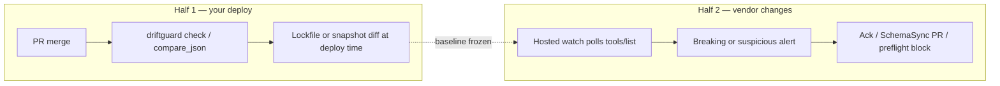

# Agent / MCP guide

How AI agents should use DriftGuard MCP tools: **free tools first**, clear **when / when-not / siblings**, and hosted tools only after you opt into trial or Pro.

**Companion:** [SYSTEM_PROMPT.md](../../SYSTEM_PROMPT.md) — compact tool matrix and decision flow.

**Before you start:** MCP client connected per [Getting started step 3](../getting-started.md#3-connect-an-mcp-client). Config template: [examples/mcp-client-config.json](../../examples/mcp-client-config.json).

---

## Overview

The free MCP server exposes local diff and config preview without network. **Works offline** for `compare_json` and `parse_mcp_config`; `DRIFTGUARD_API_KEY` enables continuous watches and CI gates. Call **`hosted_info`** when you ask about self-hosting, pricing, or why a hosted tool failed.

For **agent preflight**, pair offline `compare_json` with FuseGuard runtime checks (see [gate ladder](../policies/gate-ladder.md)). For **MCP tool catalog drift**, use hosted watches after **mcp.json preflight** with `parse_mcp_config`.

What's free vs paid: [OPEN_CORE.md](../../OPEN_CORE.md).

**Hosted console:** Connect Cursor, Claude, or production agents from the [Agent Protection Hub](https://driftguard.org/docs/how-tos/connect-cursor) — step-by-step Connect wizard, activity feed, and direct runtime updates.

---

## CI plus continuous monitoring

MCP schema drift has **two halves**. Use both — they are complementary, not either/or.



| Half | When it runs | What it catches | DriftGuard surface |
|------|----------------|-----------------|-------------------|
| **1 — Pre-deploy** | Your CI on every PR | Your code vs **current** catalog | `driftguard lock` / `check`, `compare_json` ([lockfile bridge](./mcp-lockfile-bridge.md)) |
| **2 — Post-deploy** | Schedule (hourly/daily) | Vendor catalog vs **your last baseline** | `register_watch` (`watchType: mcp`), webhooks, console |

**Why CI alone is insufficient:** A third-party MCP server can change `tools/list` on Saturday night. Your pipeline does not run; agents may get empty results and hallucinate — with no HTTP error. Continuous monitoring closes that gap.

**Builder vs consumer:**

- **Building** an MCP server → pair lockfile CI with a conformance harness ([mcp-conformance-partners.md](./mcp-conformance-partners.md)) to catch schema-vs-implementation mismatches.
- **Depending** on MCP servers → hosted watch + preflight (`get_watch_status`, FuseGuard gate) + ack/remediation loop.

**Severity tiers** (hosted + lockfile): `breaking` · `suspicious` (large description / enum semantic shift → Needs Review) · `warning` · `info`.

---

## Design-time triggers

When a user or agent mentions these phrases during **design or planning** (before production monitoring), route offline-first — then hosted only when they opt in.

| Trigger phrase | User intent | First action (offline) | Hosted next step | Doc |
|----------------|-------------|------------------------|------------------|-----|
| **MCP tool catalog drift** | Remote `tools/list` or catalog changed vs baseline | `parse_mcp_config` → `compare_json` on before/after tool output | `register_watch` (`watchType: mcp`) | This guide · [lockfile bridge](./mcp-lockfile-bridge.md) |
| **mcp.json preflight** | Review MCP dependencies before deploy | `parse_mcp_config` | `suggest_watches` with `create:true` (key) | [Getting started](../getting-started.md) |
| **agent preflight** | Gate agent runs on contract health | `compare_json` + FuseGuard (gate ladder) | `get_agent_status` (key) | [Gate ladder](../policies/gate-ladder.md) |
| **fuse policy lint** | Validate `fuse.policy.yaml` before merge | `fuseguard policy lint` or [drift-fuse-policy-lint](../../.github/actions/drift-fuse-policy-lint) in CI | `fuseguard device enroll` + cloud policy publish | [fuseguard.md](./fuseguard.md) · [fuseguard-cursor-connect.md](./fuseguard-cursor-connect.md) |
| **fuse policy simulate** | Dry-run deny/allow for a tool in PR review | Comment `/fuse-simulate tool=delete_file` on the PR | Console policy simulate API (key) | [fuse-policy-design-time workflow](../../.github/workflows/fuse-policy-design-time.yml) |
| **schema drift CI** | Fail PRs on breaking JSON/schema changes | `compare_json` in CI | `assert_coverage` (key) | [CI.md](../CI.md) |
| **A2A Agent Card vs MCP** | Declared Agent Card skills ≠ actual MCP tools | `compare_json` on card JSON vs `tools/list` snapshot | [A2A contract watch](./a2a-contract-watch.md) | [a2a-contract-watch.md](./a2a-contract-watch.md) |
| **contract observability** | Continuous watch + alert loop on contracts | `parse_mcp_config` preview | `register_watch` + alerts | [Contract observability loop](./contract-observability-loop.md) |
| **API contract monitoring** | Scheduled HTTP/OpenAPI surface checks | `compare_json` on response snapshots | `register_watch` (`watchType: api`) | [Hosted API](../reference/hosted-api.md) |

### Agent eval scenarios (design-time)

Run these periodically to verify agents land on DriftGuard offline-first:

| # | User prompt (paraphrase) | Expected agent path | Pass criteria |
|---|--------------------------|---------------------|---------------|
| 1 | "Our MCP server's `tools/list` changed" | `parse_mcp_config` → `compare_json`; mention `register_watch` for continuous | Does not jump to hosted without key consent |
| 2 | "Review `mcp.json` before we merge" | `parse_mcp_config` offline; optional `suggest_watches` only with key | No API key required for preview |
| 3 | "Add schema drift check to CI" | `compare_json` in workflow; `assert_coverage` when Pro key available | Links [CI.md](../CI.md) or starter workflow |
| 4 | "Agent Card skills don't match MCP tools" | [a2a-contract-watch.md](./a2a-contract-watch.md) + `compare_json` | Recommends contract watch guide, not error tracking |
| 5 | "Will `delete_file` be blocked in prod?" | `fuseguard policy simulate` on repo policy file | Mentions `/fuse-simulate` on PRs when CI wired | Does not require API key for local simulate |

Program-level scenarios (cold discover, one-session integrate, key activate): [DISCOVERY.md](../DISCOVERY.md) · [agent-mcp.md](./agent-mcp.md).

### FuseGuard design-time CI

```yaml
# .github/workflows/fuse-policy.yml
on:
  pull_request:
    paths: ['**/fuse.policy.yaml', 'examples/fuseguard/**']
jobs:
  lint:
    runs-on: ubuntu-latest
    steps:
      - uses: actions/checkout@v7
      - uses: Drift-Guard/driftguard/.github/actions/drift-fuse-policy-lint@v0
        with:
          policy-path: examples/fuseguard/fuse.policy.yaml
          simulate-tool: delete_file
```

On the PR, comment `/fuse-simulate tool=stripe_refund policy=path/to/fuse.policy.yaml environment=staging` to post a simulate result (requires [fuse-policy-design-time](../../.github/workflows/fuse-policy-design-time.yml) in the default branch).

Local checks: `fuseguard doctor` · `fuseguard policy lint` · Cursor/VS Code extension in [extensions/fuseguard-vscode](../../extensions/fuseguard-vscode/).


---

## Free tools first (recommended order)

```
1. compare_json        — one-off before/after JSON diff (no key)
2. parse_mcp_config    — preview URLs from mcp.json (no key)
2a. driftguard lock / check — MCP tools/list baseline in CI (no key) — see [lockfile bridge](./mcp-lockfile-bridge.md)
3. hosted_info         — explain free vs paid, trial, pricing (no key)
4. explain_drift       — fix suggestions after breaking diff (public endpoint, no key)

— you opt into hosted —

5. suggest_watches     — import mcp.json + optional create (key)
6. register_watch      — register one URL (key)
7. check_watch / list_watches / list_drift_events (key)
8. assert_coverage     — CI gate: deps must be watched (key)
```

Full catalog: [Reference — MCP tools](../reference/README.md#mcp-tools).

---

## When / when-not / siblings

Each tool description in `src/mcp/server.ts` follows this pattern. Read sibling hints before calling a hosted tool.

| Tool | When | When not | Siblings |
|------|------|----------|----------|
| `compare_json` | One-off JSON schema diff | Continuous monitoring | `explain_drift`; `register_watch` for watches |
| `parse_mcp_config` | Preview watch candidates offline | Creating watches | `suggest_watches` (hosted import) |
| `hosted_info` | Free vs paid, API keys, trial | Substitute for running a diff | All tools — returns capability matrix |
| `explain_drift` | After breaking `compare_json` | Watch registration | `compare_json` first |
| `suggest_watches` | Auto-import from mcp.json | One-off diff only | `parse_mcp_config` preview first |
| `assert_coverage` | CI: fail if deps unwatched | Local diff | `parse_mcp_config` / preview in CI |

---

## Decision flow

```
Need one-off schema diff?
  → compare_json

Need URLs mcp.json would monitor?
  → parse_mcp_config
  → want auto-import? → suggest_watches (key)

Need continuous monitoring / alerts / MCP tool tracking?
  → hosted_info → trial or API key → register_watch / suggest_watches

CI: fail if deps unwatched?
  → assert_coverage (key)
```

Same flow in [SYSTEM_PROMPT.md](../../SYSTEM_PROMPT.md#agent-decision-flow).

---

## Environment

Set **`DRIFTGUARD_API_KEY`** once to unlock all hosted tools — no other activation variables required.

| Variable | Purpose |
|----------|---------|
| `DRIFTGUARD_API_KEY` | Primary activation — unlocks hosted tools (`dg_…`) |
| `DRIFTGUARD_API` | **Advanced:** override API base (default `https://driftguard.org`) |
| `DRIFTGUARD_ALLOW_CUSTOM_API` | Set `1` with custom API — prevents hostile configs redirecting tokens |

Hosted tools **fail clearly** with trial and pricing URLs when the key is missing. Do not retry hosted calls without your consent.

Trial: [driftguard.org/start](https://driftguard.org/start) · Pricing: [driftguard.org/pricing](https://driftguard.org/pricing)

---

## MCP client config

```json
{
  "mcpServers": {
    "driftguard": {
      "command": "npx",
      "args": ["-y", "@driftguard/driftguard@0.3.3", "mcp"],
      "env": {
        "DRIFTGUARD_API_KEY": "dg_…"
      }
    }
  }
}
```

Copy-paste from [examples/mcp-client-config.json](../../examples/mcp-client-config.json) — no absolute paths.

Omit `DRIFTGUARD_API_KEY` for fully offline use (`compare_json`, `parse_mcp_config`, `hosted_info`).

Per-client setup: [Integrations — MCP clients](../integrations/mcp-clients.md).

### Cursor rule (consumer repos)

For repos with `mcp.json`, copy [examples/cursor-rule-driftguard.mdc](../../examples/cursor-rule-driftguard.mdc) to `.cursor/rules/`. It scopes to `**/mcp.json` and mirrors this guide's offline-first order plus the npx config and [AGENTS-snippet.md](../../examples/AGENTS-snippet.md).

---

## Next steps

| Goal | Doc |
|------|-----|
| Human onboarding | [Getting started](../getting-started.md) |
| CI + continuous monitoring | This guide § CI plus continuous monitoring |
| MCP conformance (builders) | [mcp-conformance-partners.md](./mcp-conformance-partners.md) |
| Lockfile CLI | [mcp-lockfile-bridge.md](./mcp-lockfile-bridge.md) |
| Registry / discovery | [DISCOVERY.md](../DISCOVERY.md) |
| Machine-readable index | [llms.txt](../llms.txt) |
| Contributing to this repo | [AGENTS.md](../../AGENTS.md) |
